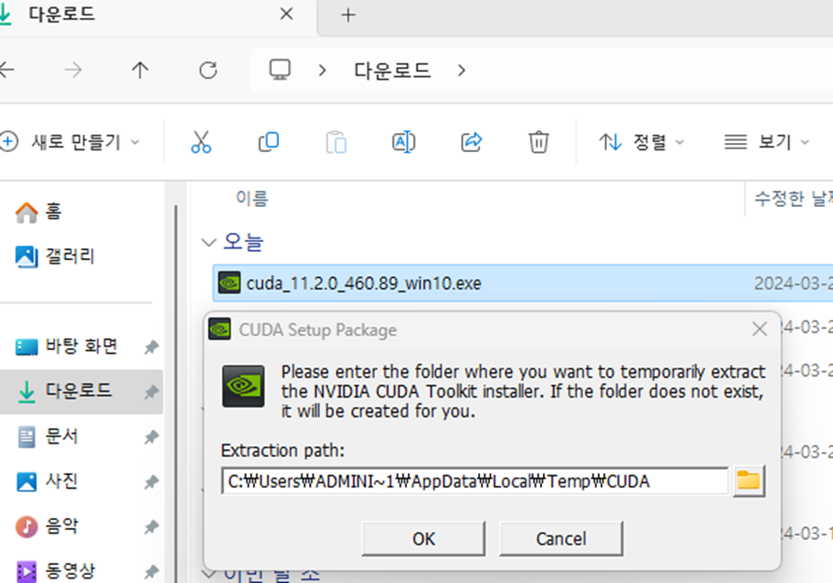

# ann
숭실대 전자정보공학부 IT융합전공 인공신경망 수업

# 2024 ANN Tool Installation Guide

---
## 1. CoLab 활용 방법
1. Jupyter notebook 파일 생성
2. 다음 링크로 구글 CoLab 접속 (https://colab.research.google.com/)
3. 생성한 Jupyter notebook 파일 업로드
4. 각 cell 실행
5. 저장하기: File -> download .jpynb -> save the file

---
## 2. GPU 워크스테이션 활용 방법(조만식 447호 실습실 기준 작성)
기준 gpu 스펙: GeForce RTX 3060
### Anaconda 설치 (컴퓨터에 설치되어 있지 않은 경우)
- 다음 링크를 통해 아나콘다 설치 진행
- https://www.anaconda.com/download#Downloads

### NVIDIA DRIVER 설치
- cmd 창에서 nvidia-smi 명령 실행 후, 아래와 같이 출력되면 nvidia 드라이버 잘 설치 되어 있는 것
- 
- 없다면 다음 링크를 통해 컴퓨터 환경에 맞는 NVIDIA 드라이버를 설치한다.
- https://www.nvidia.com/download/index.aspx?lang=en-us

### Cuda 이전버전 삭제-(11.2 version 설치 되어있는 경우 건너뛰기)
1. [프로그램 추가/제거] 들어가서 아래 NVIDIA에 관련된 프로그램을 모두 지우기 
   - **NVIDA Control Panel, 그래픽 드라이버는 남겨두기** 
   - 
   - 두 경로의 내부 NVIDIA 관련 파일 모두 삭제
   'C:/Program Files'
   'C:/Program Files(x86)'
2. [장치관리자]-[디스플레이 어댑터]-[GPU 우클릭]-[드라이버 업데이트][내 컴퓨터에서 드라이버 찾아보기(R)] 클릭
   [컴퓨터의 사용 가능한 드라이버 목록에서 직접 선택(L)] 클릭
   드라이버 선택해서 설치 진행 후 재부팅

### CUDA 설치 (CUDA 11.2.0)
(중요) python, Cuda, cuDNN, tensorflow 버전을 호환되도록 꼭 맞춰야 함
1. CUDA Toolkit 11.2.0 다운
   - 다음 링크 접속 (https://developer.nvidia.com/cuda-toolkit-archive)
   - 
2. CUDA Toolkit 11.2 선택 후 Window-x86_64-10-exe(local) 선택 후 다운로드
   - 
3. 다운 완료 후 다운로드 폴더에서 .exe 파일 실행하여 설치
   - 
   - 

### cuDNN 설치(꼭 CUDA 11.2 설치 완료 후 진행할 것)
1. CUDA 버전에 맞는 cuDNN v8.1.0 for CUDA 11.2 포함된 버전으로 설치
2. 다음 링크 접속 후 cuDNN v8.1.0 for CUDA 11.2 다운로드
   - https://developer.nvidia.com/rdp/cudnn-archive
   - 
3. 다운 완료 후 파일 압축 해제
4. 폴더 옮기기
   - 압축 파일을 풀게 되면 cuda 파일에 아래 사진과 같이 4개 파일 존재
   - 
   - 위 4개 파일 복사하여 CUDA Toolkit 폴더에 붙여넣기
   - 경로: 로컬 디스크(C:)\ Program Files\ NVIDIA GPU Computing Toolkit\ CUDA\ v11.2
   - 
5. 폴더 옮기기
   - [설정]-[시스템]-[정보]-[고급 시스템 설정] 순으로 클릭
   - 
   - [고급]-[환경 변수] 로 이동
   - 
   - [User에 대한 사용자 변수]-[Path 선택]-[편집] 클릭
   - 
   - [새로만들기] 클릭 후 3가지 환경변수 추가
     - C:\Program Files\NVIDIA GPU Computing Toolkit\CUDA\v11.2\bin 
     - C:\Program Files\NVIDIA GPU Computing Toolkit\CUDA\v11.2\lib 
     - C:\Program Files\NVIDIA GPU Computing Toolkit\CUDA\v11.2\include
   - 
6. 컴퓨터 재부팅
7. cmd 창에 명령어(nvcc --version) 입력 후 아래 사진처럼 뜨면 설치 완료
   - 

### 가상환경 구성하기(실습 위한 텐서플로우 설치)
- (Anadonda Prompt에서 실행): cmd 창이 아닌, Anadonda Prompt에서 수행. 
- 
- 처음 프롬프트 창을 열게 되면 (base) 환경으로 되어있을 것이다. 각 프로젝트 마다 사용되는 python이나 tensorflow, keras 등 다양한 버전에 충돌을 일으키지 않기 위해 가상환경을 만들어준다.
- 
- 명령어 conda create -n ANN python=3.7 실행 (가상환경 이름: ANN)
- 
- 명령어 conda activate ANN 실행 하면 (base) 환경에서 (ANN) 환경으로 변경됨
- 
- 다음 명령어 차례로 실행
  - pip install --upgrade jupyter matplotlib numpy pandas pydot scipy scikit-learn 
opencv_python daal 
  - conda install python-graphviz
  - pip install --upgrade tensorflow_datasets tensorflow-hub tensorflow-addons 
keras-tuner scikeras
  - pip install tensorflow-gpu==2.8.0
  - pip install --upgrade grpcio

### 실습 .ipynb 파일 실행
- 실습 파일 다운 후 아나콘다 프롬트 창
- 명령어 conda activate ANN 실행
- 명령어 jupyter notebook 실행
- 실습 파일 클릭 후 실행

### 추천 개발 환경 (Pycharm)
1. 다음 링크를 통해 파이참 다운로드
   - https://www.jetbrains.com/ko-kr/pycharm/download/?section=windows
2. 설치 완료후 파이참 실행시 로그인 진행
   - 계정 없으면, Jetbrains 계정 생성
   - 학교 이메일 계정으로 생성시 pycharm professional 무료 사용 가능
   - 
   - 로그인 완료 되면 Activate License 클릭
   - 
3. 프로젝트 파일 생성
   - 
   - ANN 가상환경으로 설정해주기(설정 안하면 실습코드 실행 불가)
   - [setting]- interpreter 검색 후 Add interpreter 클릭
   - 
   - [Conda Environment]-Use existing environment: ANN 클릭
   - 